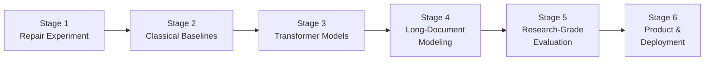

# NewsLies Overhaul: From LSTM Demo to Research-Grade Arabic Credibility Classifier

Your instructor's review is essentially a blueprint for transforming NewsLies from a single-model demo into a rigorous, multi-experiment Arabic NLP project. This plan translates all 20 points into concrete, ordered implementation steps.

> [!IMPORTANT]
> **Constraint**: All training notebooks will be prepared as Kaggle-ready `.ipynb` files. No datasets will be downloaded locally. The AFND dataset is accessed at `/kaggle/input/arabic-fake-news-dataset-afnd/` on Kaggle. Local development is limited to `src/` modules, configs, and the web app.

> [!WARNING]
> **Tool limitation**: The current tooling cannot directly edit `.ipynb` files. Training notebooks will be generated as Python scripts (`.py`) with cell markers (`# %%`) that Kaggle and VS Code both recognize as notebook cells. You can upload these directly to Kaggle or convert them with `jupytext`.

---

## Open Questions

> [!IMPORTANT]
> **Q1 — Kaggle GPU quota**: AraBERT/CAMeLBERT fine-tuning requires GPU. Kaggle provides 30 hrs/week of T4 GPU. The full experiment matrix (E0–E10 + ablations) will require multiple sessions across several weeks. Is that acceptable, or do you want to prioritize a subset?

> [!IMPORTANT]
> **Q2 — Scope for submission**: Your instructor laid out 20 points and 6 stages. Do you want to implement all 6 stages now, or do you want to start with Stages 1–3 (repair experiment + baselines + first Transformer), get results, and then proceed to Stages 4–6?

> [!IMPORTANT]
> **Q3 — Evidence-aware verification (Point 14)**: Your instructor described this as aspirational ("the really serious version"). Should we plan for it as a future stage, or is it out of scope for this submission?

> [!IMPORTANT]
> **Q4 — TensorFlow removal**: The instructor's review doesn't mention TensorFlow at all. `train_tensorflow.py` is a CPU-only duplicate. Should we remove it from the project and keep only PyTorch?

---

## Proposed Changes

### Overview: 6 Stages



---

### Stage 1 — Repair the Experiment (Foundation)

*Addresses instructor points: 1, 2, 8, 9, 10, 11, 12, 18*

This is the most critical stage. Without it, every subsequent model trains on a flawed experimental setup.

---

#### Project Restructure (Point 18)

The flat file layout becomes a proper ML project:

```
NewsLies/
├── configs/
│   ├── lstm_baseline.yaml
│   ├── bigru_attention.yaml
│   ├── arabert.yaml
│   ├── camelbert.yaml
│   └── hierarchical.yaml
│
├── src/
│   ├── __init__.py
│   ├── data/
│   │   ├── __init__.py
│   │   ├── loader.py          # Unified AFND loader (Kaggle + local paths)
│   │   ├── cleaner.py         # Dedup, junk removal, Unicode normalization
│   │   ├── splits.py          # Random, source-disjoint, temporal, combined
│   │   └── preprocessing.py   # LSTM-style vs Transformer-style preprocessing
│   │
│   ├── models/
│   │   ├── __init__.py
│   │   ├── lstm.py            # Current LSTMClassifier (cleaned up)
│   │   ├── bigru_attention.py # BiGRU + self-attention
│   │   ├── arabert.py         # AraBERT/CAMeLBERT fine-tuning wrapper
│   │   └── hierarchical.py    # Chunked Transformer + cross-chunk attention
│   │
│   ├── training/
│   │   ├── __init__.py
│   │   ├── trainer.py         # Unified training loop (supports all models)
│   │   ├── losses.py          # CrossEntropy, Weighted CE, Focal Loss
│   │   └── scheduler.py       # Warmup + cosine decay
│   │
│   ├── evaluation/
│   │   ├── __init__.py
│   │   ├── metrics.py         # Full metric suite (Macro F1, MCC, ECE, etc.)
│   │   ├── calibration.py     # Temperature scaling
│   │   └── analysis.py        # Source leakage, length analysis, error analysis
│   │
│   └── inference/
│       ├── __init__.py
│       └── pipeline.py        # Unified inference for export
│
├── notebooks/                 # Kaggle-ready training notebooks
│   ├── 00_data_exploration.py
│   ├── 01_data_cleaning.py
│   ├── 02_source_leakage_analysis.py
│   ├── 03_lstm_baseline.py
│   ├── 04_tfidf_svm.py
│   ├── 05_bigru_attention.py
│   ├── 06_arabert.py
│   ├── 07_camelbert.py
│   ├── 08_hierarchical_bert.py
│   ├── 09_ablations.py
│   └── 10_calibration_explainability.py
│
├── experiments/               # Saved results, metrics, plots
│   └── results.json           # Central results ledger
│
├── docs/                      # Web demo (updated)
│   ├── index.html
│   ├── js/app.js
│   ├── model.onnx
│   ├── vocab.json
│   └── stopwords.json
│
├── train_pytorch.py           # Legacy (kept for reference, deprecated)
├── train_tensorflow.py        # Legacy (kept for reference, deprecated)
├── export_model.py            # Updated for new model exports
├── requirements.txt           # Updated
├── README.md                  # Completely rewritten
└── LICENSE
```

#### [NEW] [loader.py](file:///home/assem-elqersh/Desktop/NewsLies/src/data/loader.py)
- Unified AFND loader supporting both Kaggle paths (`/kaggle/input/...`) and local paths (`data/AFND/`) via `os.path.exists()` fallback
- Loads all fields: `title`, `text`, `published_date`, `source`, `label`
- Returns a clean DataFrame with all fields preserved

#### [NEW] [cleaner.py](file:///home/assem-elqersh/Desktop/NewsLies/src/data/cleaner.py)
- **Exact duplicate removal**: hash `normalized_title + normalized_body`, drop duplicates
- **Near-duplicate detection**: MinHash/SimHash on body text, flag pairs with Jaccard > 0.9
- **Junk filtering**: remove articles with empty text, text < 10 words, HTML tags, repeated boilerplate
- **Unicode normalization**: NFKC normalization, Arabic-specific character normalization (hamza forms, tah marbuta, etc.)
- **Length statistics**: compute and log article length distributions per class
- Outputs: cleaned DataFrame + cleaning report (counts removed per category)

#### [NEW] [splits.py](file:///home/assem-elqersh/Desktop/NewsLies/src/data/splits.py)
Four split strategies, each returning `(train_df, val_df, test_df)`:

| Split | Method | Instructor Reference |
|-------|--------|---------------------|
| `random_split` | Stratified random 64/16/20 on articles | Experiment A (current) |
| `source_disjoint_split` | Sources 1–90 train, 91–112 val, 113–134 test. No source in multiple splits. | Experiment B |
| `temporal_split` | Sort by `published_date`. Earliest 70% train, next 10% val, final 20% test. | Experiment C |
| `source_temporal_split` | Hold out some sources entirely for test; within remaining sources, split temporally. | Experiment D |

Each function logs split statistics: articles per split, label distribution per split, sources per split.

#### [NEW] [preprocessing.py](file:///home/assem-elqersh/Desktop/NewsLies/src/data/preprocessing.py)
Two preprocessing pipelines:

**Classical pipeline** (for LSTM, TF-IDF, BiGRU):
```
lowercase → Arabic stopword removal → ISRI stemming → tokenize
```

**Transformer pipeline** (for AraBERT, CAMeLBERT):
```
Unicode NFKC normalization → whitespace cleanup → repeated-char normalization → [AraBERT pre-segmenter if applicable] → pretrained tokenizer
```

Title+body concatenation modes:
- `body_only`: current behavior
- `title_body_concat`: `"[CLS] title [SEP] body [SEP]"` for Transformers, `"title . body"` for classical
- `title_body_separate`: returns two tensors for dual-encoder architectures

#### [NEW] [metrics.py](file:///home/assem-elqersh/Desktop/NewsLies/src/evaluation/metrics.py)
Comprehensive metric computation (Point 10):

```python
{
    "accuracy": float,
    "balanced_accuracy": float,
    "macro_f1": float,
    "weighted_f1": float,
    "mcc": float,  # Matthews Correlation Coefficient
    "per_class": {
        "credible":     {"precision": ..., "recall": ..., "f1": ...},
        "not credible": {"precision": ..., "recall": ..., "f1": ...},
        "undecided":    {"precision": ..., "recall": ..., "f1": ...},
    },
    "confusion_matrix": [[...]],
    "ece": float,  # Expected Calibration Error
}
```

All experiments write results to `experiments/results.json` in a structured format with experiment ID, model name, split strategy, and full metrics.

#### [NEW] [analysis.py](file:///home/assem-elqersh/Desktop/NewsLies/src/evaluation/analysis.py)
Source leakage investigation (Point 12):

1. **Source → Label classifier**: Train `source_id → label`. Report accuracy. If near-perfect, confirms source-level labeling leaks through random splits.
2. **Text → Source classifier**: Train article text to predict source. If text strongly identifies publisher, the model can shortcut via stylistic cues.
3. **Length → Label analysis**: Plot article length distributions per class. Check if length alone is predictive.

#### [NEW] [losses.py](file:///home/assem-elqersh/Desktop/NewsLies/src/training/losses.py)
- `WeightedCrossEntropy`: class weights computed from inverse frequency
- `FocalLoss`: with tunable gamma (default 2.0) and optional class weights
- Both benchmarked, not blindly applied (Point 9)

---

### Stage 2 — Classical Baselines (Points 6, 19)

#### [NEW] [notebooks/04_tfidf_svm.py](file:///home/assem-elqersh/Desktop/NewsLies/notebooks/04_tfidf_svm.py)
**Model 1**: TF-IDF (word + character n-grams) + Linear SVM / Logistic Regression
- Input: `title + body` (classical preprocessing)
- Splits: random + source-disjoint
- Reports full metric suite
- This establishes whether a simple linear model already captures the signal

#### [NEW] [notebooks/05_bigru_attention.py](file:///home/assem-elqersh/Desktop/NewsLies/notebooks/05_bigru_attention.py)
**Model 2**: FastText embeddings + BiGRU + self-attention
- 300-d FastText Arabic embeddings (loaded on Kaggle)
- Bidirectional GRU with self-attention pooling
- Input: `title + body`, sequence length 256 (increase from 128)
- Class weighting via weighted CE

#### [NEW] [bigru_attention.py](file:///home/assem-elqersh/Desktop/NewsLies/src/models/bigru_attention.py)
Architecture:
```
Embedding (FastText 300d, frozen or fine-tunable)
   ↓
BiGRU (128 units)
   ↓
Self-Attention pooling
   ↓
Linear (3 classes)
```

---

### Stage 3 — Transformer Models (Points 3, 4, 5, 8)

#### [NEW] [arabert.py](file:///home/assem-elqersh/Desktop/NewsLies/src/models/arabert.py)
Wrapper for HuggingFace Transformer fine-tuning:
- Supports `aubmindlab/bert-base-arabertv02` and `CAMeL-Lab/bert-base-arabic-camelbert-msa`
- `[CLS]` pooling → linear classification head
- Title + body via `[CLS] title [SEP] body [SEP]` with truncation to 512 tokens
- **No** stemming or stopword removal — Transformer-native preprocessing only
- AraBERT pre-segmentation via `arabert.preprocess` when using AraBERT

#### [NEW] [notebooks/06_arabert.py](file:///home/assem-elqersh/Desktop/NewsLies/notebooks/06_arabert.py)
**Model 3**: AraBERTv2-base fine-tuning
- Training config: AdamW, lr=2e-5, warmup 10% steps, cosine decay, gradient clipping 1.0
- Mixed precision (fp16) for Kaggle T4
- Evaluated on all 4 split strategies
- Full metric suite

#### [NEW] [notebooks/07_camelbert.py](file:///home/assem-elqersh/Desktop/NewsLies/notebooks/07_camelbert.py)
**Model 4**: CAMeLBERT-MSA fine-tuning
- Same protocol as AraBERT for fair comparison
- CAMeLBERT is specifically pretrained on MSA text, which matches AFND's news domain

#### [NEW] [scheduler.py](file:///home/assem-elqersh/Desktop/NewsLies/src/training/scheduler.py)
- Linear warmup + cosine annealing schedule
- Compatible with HuggingFace `get_cosine_schedule_with_warmup`

---

### Stage 4 — Long-Document Modeling (Points 2, 7, 8, 15)

#### [NEW] [hierarchical.py](file:///home/assem-elqersh/Desktop/NewsLies/src/models/hierarchical.py)
Hierarchical Transformer architecture (Point 7, 15):

```
TITLE ──► Transformer ──► title_emb ──┐
                                       ├──► Fusion ──► MLP ──► 3 classes
BODY ──► chunk(512) ──► Transformer   │
         ├─ chunk 1 ──► h1           │
         ├─ chunk 2 ──► h2           │
         └─ chunk N ──► hN           │
              ↓                       │
         Cross-chunk MHA ──► doc_emb ─┘
```

- Body split into overlapping 512-token chunks (stride 256)
- Each chunk encoded by frozen/fine-tuned AraBERT
- Cross-chunk multi-head attention (2 heads, 768-d) produces document embedding
- Title encoded separately, concatenated with document embedding
- Classification head: `[title_emb; doc_emb] → LayerNorm → Linear(1536, 256) → GELU → Linear(256, 3)`

#### [NEW] [notebooks/08_hierarchical_bert.py](file:///home/assem-elqersh/Desktop/NewsLies/notebooks/08_hierarchical_bert.py)
- Trains the hierarchical model on source-disjoint split
- Compares against flat AraBERT (truncated to 512) to isolate the contribution of full-document modeling
- Reports chunk-level attention visualizations

---

### Stage 5 — Research-Grade Evaluation (Points 10, 16, 17, 19)

#### [NEW] [calibration.py](file:///home/assem-elqersh/Desktop/NewsLies/src/evaluation/calibration.py)
- **Temperature scaling** on validation set logits
- **ECE** (Expected Calibration Error) computation with reliability diagrams
- Transforms raw softmax scores into calibrated probabilities
- Outputs calibrated confidence + uncertainty level (Low/Moderate/High)

#### [NEW] [notebooks/09_ablations.py](file:///home/assem-elqersh/Desktop/NewsLies/notebooks/09_ablations.py)
Full ablation study (Point 19):

| Ablation | What it tests |
|----------|---------------|
| body only vs title+body | Value of title |
| 128 vs 256 vs 512 tokens | Sequence length impact |
| No weighting vs weighted CE vs focal loss | Class imbalance handling |
| Random vs source-disjoint vs temporal split | Evaluation rigor |
| LSTM vs BiGRU vs AraBERT vs CAMeLBERT | Architecture progression |
| Flat 512 vs hierarchical chunking | Long-document modeling |

#### [NEW] [notebooks/10_calibration_explainability.py](file:///home/assem-elqersh/Desktop/NewsLies/notebooks/10_calibration_explainability.py)
- Temperature scaling calibration on best model
- SHAP / Integrated Gradients attribution on misclassified examples
- Per-sentence importance highlighting
- Error analysis: systematic examination of failure modes by class, length, and source type

---

### Stage 6 — Product & Deployment (Points 13, 16, 18)

#### [MODIFY] [index.html](file:///home/assem-elqersh/Desktop/NewsLies/docs/index.html)
- Rename "Arabic Fake News Detector" → "Arabic News Credibility Classifier"
- Add uncertainty display: `Prediction | Calibrated Confidence | Uncertainty Level`
- Update accuracy badge from 70% to final best result
- Add disclaimer: "This model classifies text based on source-level credibility patterns. It does not fact-check individual claims against evidence."

#### [MODIFY] [app.js](file:///home/assem-elqersh/Desktop/NewsLies/docs/js/app.js)
- Update inference to use the new best model's ONNX export
- Add calibrated confidence display (temperature scaling applied client-side)
- Add uncertainty indicator (Low/Moderate/High based on calibrated probability thresholds)

#### [MODIFY] [README.md](file:///home/assem-elqersh/Desktop/NewsLies/README.md)
Complete rewrite:
- Project description updated to "Arabic News Credibility Classifier"
- Full experiment matrix with results table
- Architecture diagrams for each model
- Discussion of source-level vs article-level labeling
- Honest limitations section
- Provenance ledger of all empirical findings

#### [MODIFY] [export_model.py](file:///home/assem-elqersh/Desktop/NewsLies/export_model.py)
- Support exporting AraBERT/hierarchical models to ONNX
- Export calibration temperature parameter alongside model
- Export Transformer tokenizer vocabulary (replacing the word2idx vocab)

#### [MODIFY] [requirements.txt](file:///home/assem-elqersh/Desktop/NewsLies/requirements.txt)
Updated dependencies:
```
torch>=2.2.0
transformers>=4.40.0
arabert>=1.0.1
datasets>=2.19.0
scikit-learn>=1.3.0
pandas>=2.0.3
numpy>=1.25.2
matplotlib>=3.7.2
seaborn>=0.12.2
tqdm>=4.66.0
nltk>=3.8.1
onnx>=1.16.0
onnxruntime>=1.18.0
datasketch>=1.6.0
shap>=0.45.0
captum>=0.7.0
pyarabic>=0.6.15
```

---

## Experiment Matrix (Point 19)

| ID | Model | Input | Split | Purpose |
|----|-------|-------|-------|---------|
| E0 | Majority classifier | — | random | Sanity baseline |
| E1 | TF-IDF + Linear SVM | title+body | random | Classical baseline |
| E2 | LSTM (current, cleaned) | body 128tok | random | Your existing baseline |
| E3 | BiGRU + self-attention | title+body 256tok | random | Neural baseline |
| E4 | AraBERTv2-base | title+body 512tok | random | Transformer baseline |
| E5 | CAMeLBERT-MSA | title+body 512tok | random | Arabic MSA encoder |
| E6 | AraBERTv2-base | title+body 512tok | source-disjoint | Generalization test |
| E7 | AraBERTv2-base | title+body 512tok | temporal | Temporal drift test |
| E8 | Hierarchical AraBERT | title + full body | source-disjoint | Long-document |
| E9 | Best model + class weighting | title + full body | source-disjoint | Imbalance handling |
| E10 | Best model + calibration | title + full body | source-disjoint | Deployment-ready |

---

## Verification Plan

### Automated Tests
Each notebook produces:
- Full metric JSON saved to `experiments/results.json`
- Confusion matrix plots saved to `experiments/<experiment_id>/`
- Training curves (loss, accuracy, macro F1 per epoch)
- The Provenance Ledger in `README.md` updated with every empirical finding

### Validation Checks
1. **Data cleaning**: log exact counts of removed duplicates, junk articles, and length distributions before/after cleaning
2. **Source leakage**: verify source→label classifier accuracy (expect ~100% if leak exists) and text→source classifier accuracy
3. **Split correctness**: verify zero source overlap between train/val/test in source-disjoint splits
4. **Metric consistency**: cross-check accuracy from confusion matrix vs sklearn accuracy_score
5. **Calibration**: reliability diagrams showing ECE before/after temperature scaling

### Manual Verification
- Run the updated web demo locally and verify credibility predictions with calibrated confidence
- Verify all experiment results are logged in the Provenance Ledger
